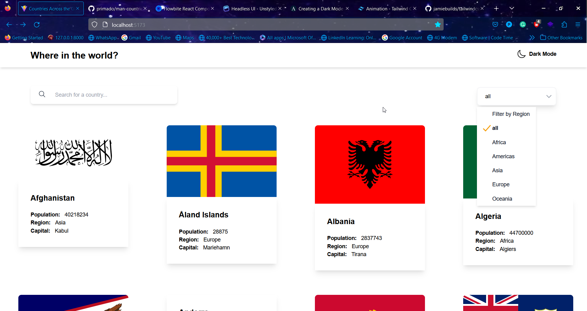

# AmaliTech NSS Program Challenge - REST Country API with color theme switcher

This is a solution to the [Blogr landing page challenge on Frontend Mentor](https://www.frontendmentor.io/challenges/blogr-landing-page-EX2RLAApP). Frontend Mentor challenges help you improve your coding skills by building realistic projects. 

## Table of contents

- [Overview](#overview)
  - [The challenge](#the-challenge)
  - [Screenshot](#screenshot)
  - [Links](#links)
- [My process](#my-process)
  - [Built with](#built-with)
  - [What I learned](#what-i-learned)
  - [Continued development](#continued-development)
  - [Useful resources](#useful-resources)
- [Author](#author)
- [Acknowledgments](#acknowledgments)

**Note: Delete this note and update the table of contents based on what sections you keep.**

## Overview

### The challenge

Users should be able to:

- Your users should be able to:

1. View the optimal layout for the site depending on their device's screen size
2. See all countries from the API on the homepage
3. Search for a country using an input field
4. Filter countries by region
5. Click on a country to see more detailed information on a separate page
6. Click through to the border countries on the detail page
7. Toggle the color scheme between light and dark mode

### Screenshot


| **Light Mode** | **Dark Mode** |
| ---------- | --------- |
|  | |
|  | |
|  | |
|  | |

| **Light Mobile View** | **Dark Mobile View** |
| --------------------- | -------------------- |
|  |  |
|  |  |


### Links

- Live Site URL: [Deployed Site](https://man-countries.netlify.app/)

## My process

### Built with

- JSX
- [Tailwind CSS](https://tailwindcss.com/) - For styles
- Flexbox
- CSS Grid
- Desktop-first workflow
- [React](https://reactjs.org/) - JS library
- [Headlessui](https://headlessui.com/) - Unstyled UI components
- [React-router](https://reactrouter.com/) - For routing
- [React-icons](https://react-icons.github.io/react-icons/) - For icons
- [Tailwind Animate](https://github.com/jamiebuilds/tailwindcss-animate) - For animations
- [SWR](https://swr.vercel.app/) - For data fetching


### What I learned

Through this project, I learnt how to use the SWR library to fetch data from an API. I also learnt how to use the React-router library to create routes for my application. I also learnt how to use the Tailwind Animate library to animate my application.


To see how you can add code snippets, see below:


```JSX
<div className="mode">
  <button
  className="theme-toggle"
  onClick={toggleTheme}
  >
  {theme === 'dark' ? (
      <div className="flex items-center gap-x-2 animate-in slide-in-from-top spin-in-3 fade-in-50 duration-700 ease-in-out">
          <IoSunnySharp className="w-6 h-6 dark:text-white"/> 
          <span className="dark:text-gray-300 font-semibold text-sm">Light Mode</span>
      </div>
     )
     : (
      <div className="flex items-center gap-x-2 animate-out slide-out-to-top spin-in-3 fade-in-50 duration-700 ease-in-out">
          <IoMoonOutline className="w-6 h-6"/>
          <span className="dark:text-gray-300 font-semibold text-sm">Dark Mode</span>
      </div>
     )}
  </button>
</div>
```

```js
const { data, error } = useSWR(
    `https://restcountries.com/v2/all?fields=name,population,region,capital,flags`,
    fetcher
  );
}
```

### Continued development

I'm still new to fetching data from an API, so I'll continue to practice using the SWR library to fetch data from an API. I'll also continue to practice using the React-router library to create routes for my application. 
After this project, I will be building project that fetches data from an API and also working more on my JavaScript skills in React. 


### Useful resources

- [ChatGPT](https://chat.openai.com) - ChatGPT helped me get answers to my questions about the SWR library. And general errors I had during development.
- [Aabishkar Wagle](https://aabishkar.info.np/blogs/creating-a-dark-mode-feature-for-your-reactnextjs-application-with-tailwind-css) - I used this resouce to learn how to create a dark mode feature for my application.


## Author

- Website - [Prince Adimado's Blog](https://prince-adimado.hashnode.com/)
- Twitter - [@_primado](https://www.twitter.com/_primado)
- LinkedIn - [Prince Adimado](https://www.linkedin.com/in/primado/)

## Acknowledgments

I would like to thank [Nathaniel Quansah](https://twitter.com/onihani) for his help during this project.

